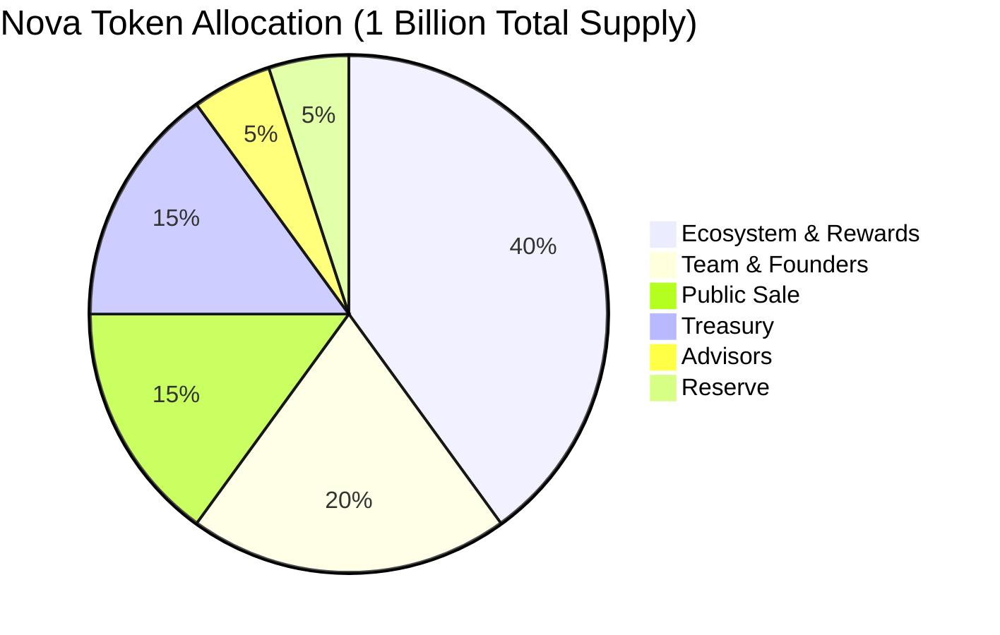
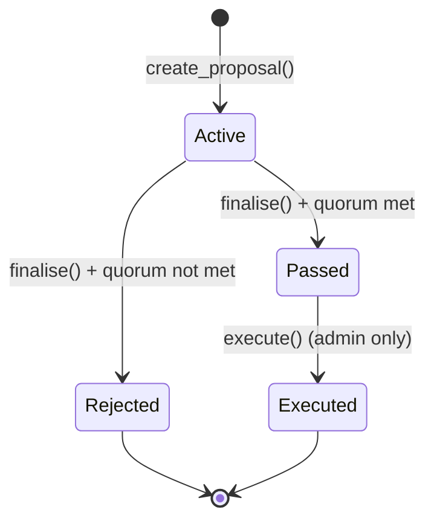
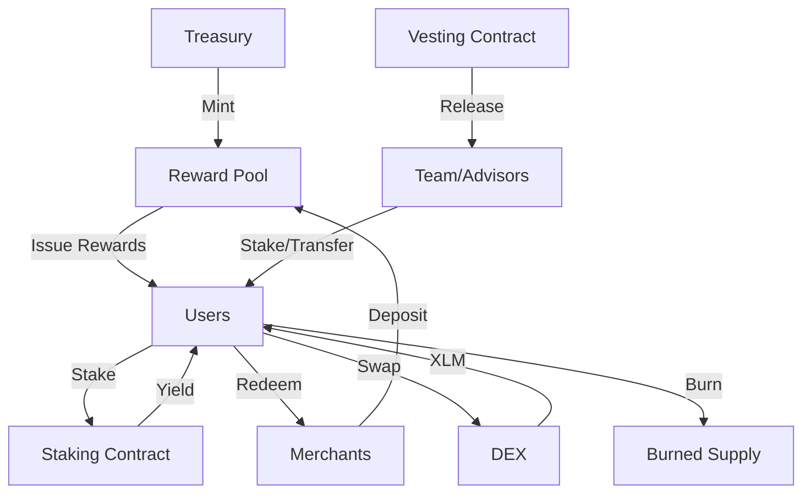
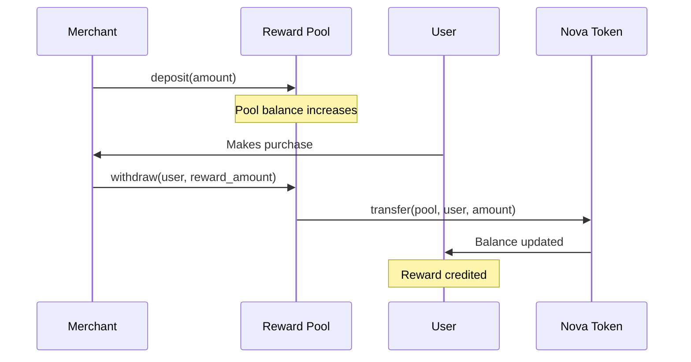
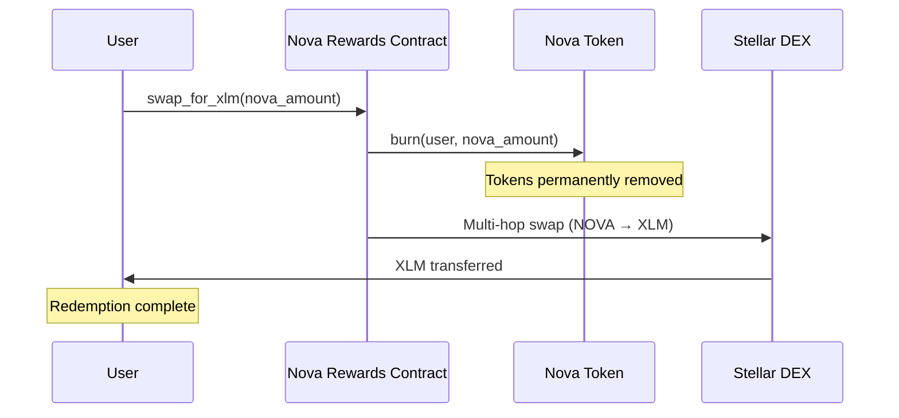
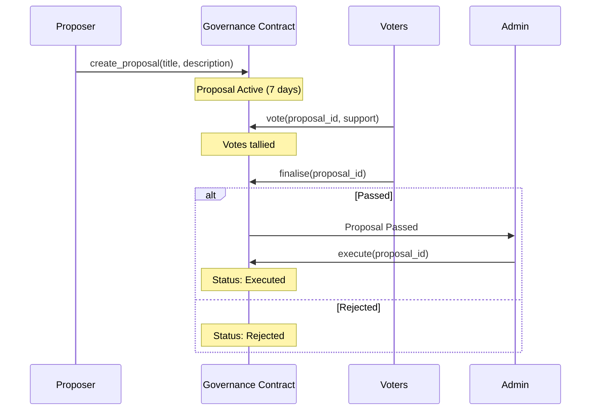

# Nova Rewards — Tokenomics

**Version:** 1.0  
**Last Updated:** May 31, 2026  
**Status:** Final

---

## Executive Summary

Nova Rewards operates on a transparent, blockchain-based tokenomics model built on the Stellar network using Soroban smart contracts. The NOVA token serves as the core utility token for the rewards ecosystem, enabling merchants to incentivize customer engagement while providing users with true ownership of their loyalty rewards.

This document outlines the complete token supply, distribution model, vesting schedules, reward emission mechanics, and governance framework that powers the Nova Rewards platform.

---

## Table of Contents

1. [Token Overview](#token-overview)
2. [Total Supply & Distribution](#total-supply--distribution)
3. [Vesting Schedules](#vesting-schedules)
4. [Reward Emission Model](#reward-emission-model)
5. [Governance Mechanics](#governance-mechanics)
6. [Token Flow Diagrams](#token-flow-diagrams)
7. [Deflationary Mechanisms](#deflationary-mechanisms)
8. [Economic Sustainability](#economic-sustainability)
9. [Technical Implementation](#technical-implementation)
10. [References](#references)

---

## Token Overview

### Basic Token Information

| Parameter | Value |
|-----------|-------|
| **Token Name** | Nova Token |
| **Token Symbol** | NOVA |
| **Total Supply** | 1,000,000,000 NOVA (1 billion) |
| **Decimals** | 7 (Stellar standard) |
| **Blockchain** | Stellar (Soroban) |
| **Token Type** | Utility Token |
| **Contract** | `contracts/nova_token/src/lib.rs` |
| **Mintable** | Yes (admin-gated) |
| **Burnable** | Yes (user-initiated) |

### Token Utility

The NOVA token serves multiple functions within the ecosystem:

1. **Loyalty Rewards** — Merchants issue NOVA tokens to customers for purchases and engagement
2. **Redemption Currency** — Users redeem NOVA for products, services, or XLM
3. **Staking** — Users stake NOVA to earn yield (V2 feature)
4. **Governance** — Token holders vote on protocol parameter changes
5. **Referral Incentives** — Users earn NOVA for successful referrals

---

## Total Supply & Distribution

### Initial Allocation

The total supply of 1,000,000,000 NOVA tokens is allocated across six categories to balance ecosystem growth, team incentives, and long-term sustainability.



### Detailed Allocation Table

| Category | % of Supply | Token Amount | Purpose |
|----------|-------------|--------------|---------|
| **Ecosystem & Rewards** | 40% | 400,000,000 NOVA | User rewards, merchant incentives, referral bonuses, staking yield |
| **Team & Founders** | 20% | 200,000,000 NOVA | Core team compensation with 12-month cliff and 36-month vesting |
| **Public Sale** | 15% | 150,000,000 NOVA | Community distribution, liquidity provision, exchange listings |
| **Treasury** | 15% | 150,000,000 NOVA | Protocol development, partnerships, emergency reserves |
| **Advisors** | 5% | 50,000,000 NOVA | Strategic advisors with 6-month cliff and 24-month vesting |
| **Reserve** | 5% | 50,000,000 NOVA | Future strategic initiatives, unforeseen opportunities |
| **TOTAL** | 100% | 1,000,000,000 NOVA | |

### Allocation Rationale

- **Ecosystem & Rewards (40%)** — The largest allocation ensures sufficient tokens to incentivize user adoption and merchant participation over a 4-year emission period
- **Team & Founders (20%)** — Competitive compensation with long vesting to align team incentives with long-term success
- **Public Sale (15%)** — Provides community access while maintaining decentralization
- **Treasury (15%)** — Funds ongoing development, audits, partnerships, and operational expenses
- **Advisors (5%)** — Attracts strategic guidance from industry experts
- **Reserve (5%)** — Flexibility for future opportunities without requiring governance approval

---

## Vesting Schedules

All token allocations except Ecosystem & Rewards follow time-locked vesting schedules implemented via the `contracts/vesting/src/lib.rs` smart contract.

### Vesting Parameters by Category

| Category | Cliff Period | Vesting Duration | Release Schedule | Tokens Locked at Launch |
|----------|--------------|------------------|------------------|-------------------------|
| **Team & Founders** | 12 months | 36 months | Monthly linear | 200,000,000 NOVA |
| **Advisors** | 6 months | 24 months | Monthly linear | 50,000,000 NOVA |
| **Public Sale** | None | 6 months | Monthly linear | 150,000,000 NOVA |
| **Ecosystem & Rewards** | None | 48 months | Monthly linear | 400,000,000 NOVA |
| **Treasury** | None | None | Unlocked | 0 NOVA |
| **Reserve** | None | 12 months | Monthly linear | 50,000,000 NOVA |

### Vesting Formula

The vesting contract implements linear time-weighted release:

```
vested_amount = total_amount × (time_elapsed / total_duration)
```

Where:
- **Before cliff:** 0 tokens vested
- **After cliff, before end:** Linear pro-rata release
- **After vesting end:** 100% vested

**Example:** A team member with 1,000,000 NOVA vesting over 36 months with a 12-month cliff:
- **Months 0-12:** 0 NOVA claimable (cliff period)
- **Month 13:** 27,778 NOVA claimable (1/36 of total)
- **Month 24:** 333,333 NOVA claimable (12/36 of total)
- **Month 48:** 1,000,000 NOVA claimable (100%)

### Circulating Supply Projections

| Milestone | Circulating Supply | % of Total | Notes |
|-----------|-------------------|------------|-------|
| **Launch (Day 1)** | 175,000,000 NOVA | 17.5% | Treasury (150M) + first month ecosystem (25M) |
| **6 Months** | 275,000,000 NOVA | 27.5% | + Public sale fully vested (150M) |
| **12 Months** | 350,000,000 NOVA | 35.0% | + Team cliff reached, advisors 25% vested |
| **24 Months** | 550,000,000 NOVA | 55.0% | + Team 33% vested, advisors fully vested |
| **36 Months** | 750,000,000 NOVA | 75.0% | + Team fully vested |
| **48 Months** | 1,000,000,000 NOVA | 100.0% | Fully diluted supply (all vesting complete) |

---

## Reward Emission Model

### Ecosystem Allocation Distribution

The 400,000,000 NOVA Ecosystem & Rewards allocation is distributed over 48 months according to the following breakdown:

| Reward Type | % of Ecosystem | Token Amount | Monthly Emission | Purpose |
|-------------|----------------|--------------|------------------|---------|
| **User Rewards** | 60% | 240,000,000 NOVA | 5,000,000 NOVA | Purchase rewards, engagement bonuses |
| **Staking Yield** | 20% | 80,000,000 NOVA | 1,666,667 NOVA | APY for staked NOVA (V2) |
| **Referral Bonuses** | 10% | 40,000,000 NOVA | 833,333 NOVA | Referrer and referee rewards |
| **Merchant Incentives** | 10% | 40,000,000 NOVA | 833,333 NOVA | Onboarding bonuses, campaign co-funding |

**Total Monthly Emission:** 8,333,333 NOVA (~0.83% of total supply)

### User Reward Calculation

Merchants configure reward rates as basis points (bps) in their campaigns. The reward calculation is:

```
reward_amount = purchase_amount × reward_rate_bps / 10,000
```

**Example:** A $100 purchase with a 500 bps (5%) reward rate:
```
reward = 100 × 500 / 10,000 = 5 NOVA
```

### Referral Reward Structure

The referral system (`contracts/referral/src/lib.rs`) implements a dual-reward model:

| Event | Referrer Reward | Referee Reward | Total Issued |
|-------|-----------------|----------------|--------------|
| **Successful Referral** | 10 NOVA | 5 NOVA | 15 NOVA |
| **Referee First Purchase** | 5 NOVA | 0 NOVA | 5 NOVA |

**Constraints:**
- Each user can only be referred once (enforced on-chain)
- Referrers tracked via counter-based leaderboard
- Rewards issued immediately upon qualifying event

### Staking Yield Model (V2)

Staking rewards use continuous time-weighted accrual:

```
yield = staked_amount × annual_rate × time_elapsed / (10,000 × SECONDS_PER_YEAR)
```

Where:
- `annual_rate` — Set by admin in basis points (e.g., 500 = 5% APY)
- `time_elapsed` — Seconds between stake and unstake
- `SECONDS_PER_YEAR` — 31,536,000 (365 days)

**Example APY Scenarios:**

| Staking Duration | Amount Staked | Annual Rate | Yield Earned |
|------------------|---------------|-------------|--------------|
| 30 days | 10,000 NOVA | 5% (500 bps) | 41.10 NOVA |
| 90 days | 10,000 NOVA | 5% (500 bps) | 123.29 NOVA |
| 365 days | 10,000 NOVA | 5% (500 bps) | 500.00 NOVA |

**Sustainability:** Staking rewards are funded from the 80M NOVA staking allocation. At 5% APY with 50% of circulating supply staked, the allocation supports ~3.2 years of emissions.

---

## Governance Mechanics

### Overview

Nova Rewards implements on-chain governance via the `contracts/governance/src/lib.rs` contract, enabling token holders to propose and vote on protocol parameter changes.

### Governance Parameters

| Parameter | Value | Description |
|-----------|-------|-------------|
| **Voting Period** | 7 days (120,960 ledgers) | Duration for casting votes |
| **Quorum Requirement** | 1 yes-vote minimum | Minimum participation for proposal validity |
| **Proposal Creation** | Open to all addresses | No token threshold required |
| **Vote Weight** | 1 address = 1 vote | Simple majority (not token-weighted in V1) |
| **Execution Authority** | Admin-gated | Admin executes passed proposals |

### Governance Lifecycle



### Proposal Process

1. **Proposal Creation**
   - Any address calls `create_proposal(proposer, title, description)`
   - Proposal enters `Active` status with 7-day voting window
   - Event emitted: `("gov", "proposed")`

2. **Voting Period**
   - Token holders call `vote(voter, proposal_id, support)`
   - Each address may vote once (yes or no)
   - Votes tallied on-chain in real-time
   - Event emitted: `("gov", "voted")`

3. **Finalization**
   - After 7 days, anyone calls `finalise(proposal_id)`
   - Proposal passes if: `yes_votes >= QUORUM && yes_votes > no_votes`
   - Status transitions to `Passed` or `Rejected`
   - Event emitted: `("gov", "finalised")`

4. **Execution**
   - Admin calls `execute(proposal_id)` for passed proposals
   - Status transitions to `Executed`
   - Admin implements approved changes off-chain or via contract calls
   - Event emitted: `("gov", "executed")`

### Governable Parameters

The following protocol parameters can be modified via governance proposals:

| Parameter | Current Value | Contract | Impact |
|-----------|---------------|----------|--------|
| **Reward Pool Daily Limit** | Unlimited | `reward_pool` | User withdrawal caps |
| **Staking Annual Rate** | 5% (500 bps) | `nova-rewards` | Staking yield |
| **Referral Rewards** | 10 NOVA / 5 NOVA | `referral` | Referrer/referee bonuses |
| **Admin Roles** | Multi-sig addresses | `admin_roles` | Protocol control |
| **Vesting Schedules** | See table above | `vesting` | Token unlock timing |

### Governance Roadmap

**V1 (Current):**
- Simple majority voting (1 address = 1 vote)
- Admin-executed proposals
- Minimum quorum of 1 vote

**V2 (Planned):**
- Token-weighted voting (1 NOVA = 1 vote)
- Increased quorum requirement (e.g., 10% of circulating supply)
- Timelock for proposal execution (e.g., 48-hour delay)
- Delegation mechanism for vote proxying
- On-chain execution for whitelisted parameter changes

---

## Token Flow Diagrams

### Primary Token Flow



### Merchant Reward Issuance Flow



### Redemption & Burn Flow



### Governance Proposal Flow



---

## Deflationary Mechanisms

### Token Burn on Redemption

The NOVA token implements a deflationary model where tokens are permanently removed from circulation when users redeem rewards for XLM.

#### Burn Mechanism

| Trigger | Contract Function | Burn Amount | Implementation |
|---------|-------------------|-------------|----------------|
| **XLM Swap** | `swap_for_xlm()` | 100% of swapped NOVA | `nova_token::burn(from, amount)` |
| **Redemption Fee** | Future implementation | TBD% of redemption | Not yet implemented |

**Current Implementation:**
```rust
// From contracts/nova-rewards/src/lib.rs
pub fn swap_for_xlm(env: Env, from: Address, nova_amount: i128) {
    from.require_auth();
    // Burn the full NOVA amount
    nova_token_client.burn(&from, &nova_amount);
    // Execute multi-hop swap for XLM
    // ...
}
```

#### Burn Rate Projections

Projected annual token burn under three adoption scenarios:

| Scenario | Annual Redemptions | Avg Redemption Size | Tokens Burned/Year | % of Supply |
|----------|-------------------|---------------------|-------------------|-------------|
| **Low Adoption** | 100,000 | 50 NOVA | 5,000,000 NOVA | 0.5% |
| **Moderate Adoption** | 500,000 | 100 NOVA | 50,000,000 NOVA | 5.0% |
| **High Adoption** | 2,000,000 | 150 NOVA | 300,000,000 NOVA | 30.0% |

**Assumptions:**
- Low: 10% of users redeem monthly
- Moderate: 30% of users redeem monthly
- High: 60% of users redeem monthly

#### Deflationary Impact

The burn mechanism creates long-term deflationary pressure:

| Year | Circulating Supply (Moderate) | Burned (Cumulative) | Net Supply |
|------|-------------------------------|---------------------|------------|
| **Year 1** | 350,000,000 | 50,000,000 | 300,000,000 |
| **Year 2** | 550,000,000 | 100,000,000 | 450,000,000 |
| **Year 3** | 750,000,000 | 150,000,000 | 600,000,000 |
| **Year 4** | 1,000,000,000 | 200,000,000 | 800,000,000 |

**Note:** Actual burn rates depend on user behavior, merchant adoption, and XLM liquidity.

---

## Economic Sustainability

### Emission vs. Burn Balance

The tokenomics model balances inflationary emissions with deflationary burns:

**Inflationary Pressures:**
- Monthly ecosystem emission: 8,333,333 NOVA
- Vesting unlocks: Variable by schedule
- Total 4-year emission: 400,000,000 NOVA

**Deflationary Pressures:**
- Redemption burns: 50-300M NOVA/year (scenario-dependent)
- No re-minting of burned tokens
- Permanent supply reduction

**Equilibrium Point:** At moderate adoption (5% annual burn), the protocol reaches supply equilibrium around Year 3, after which net supply decreases.

### Treasury Sustainability

The 150,000,000 NOVA Treasury allocation funds:

| Expense Category | Annual Budget | 4-Year Total | % of Treasury |
|------------------|---------------|--------------|---------------|
| **Development** | 15,000,000 NOVA | 60,000,000 NOVA | 40% |
| **Partnerships** | 7,500,000 NOVA | 30,000,000 NOVA | 20% |
| **Audits & Security** | 5,000,000 NOVA | 20,000,000 NOVA | 13% |
| **Marketing** | 7,500,000 NOVA | 30,000,000 NOVA | 20% |
| **Emergency Reserve** | — | 10,000,000 NOVA | 7% |

**Sustainability Measures:**
- Treasury funds released quarterly based on milestones
- Governance approval required for expenditures >5M NOVA
- Unused funds roll over to subsequent quarters

### Staking Yield Sustainability

The 80,000,000 NOVA staking allocation supports yield at various participation rates:

| Staking Participation | Annual Yield (5% APY) | Years Sustainable |
|-----------------------|-----------------------|-------------------|
| **10% of supply** | 5,000,000 NOVA | 16 years |
| **30% of supply** | 15,000,000 NOVA | 5.3 years |
| **50% of supply** | 25,000,000 NOVA | 3.2 years |

**Adaptive Yield Strategy:**
- Admin adjusts `annual_rate` based on staking participation
- Target: 30% participation at 5% APY for 5+ year runway
- Governance can allocate additional Treasury funds if needed

---

## Technical Implementation

### Smart Contract Architecture

| Contract | File Path | Primary Functions | Token Role |
|----------|-----------|-------------------|------------|
| **Nova Token** | `contracts/nova_token/src/lib.rs` | `mint()`, `burn()`, `transfer()`, `approve()` | Core ERC-20 implementation |
| **Reward Pool** | `contracts/reward_pool/src/lib.rs` | `deposit()`, `withdraw()`, `set_daily_limit()` | Merchant funding, user withdrawals |
| **Vesting** | `contracts/vesting/src/lib.rs` | `create_schedule()`, `release()` | Time-locked token distribution |
| **Governance** | `contracts/governance/src/lib.rs` | `create_proposal()`, `vote()`, `execute()` | Protocol parameter changes |
| **Referral** | `contracts/referral/src/lib.rs` | `register_referral()`, `claim_reward()` | Referral tracking and rewards |
| **Nova Rewards** | `contracts/nova-rewards/src/lib.rs` | `stake()`, `unstake()`, `swap_for_xlm()` | Staking and redemption logic |

### Token Supply Management

**Minting Authority:**
- Admin-gated via `nova_token::mint(to, amount)`
- No hardcoded supply cap (enforced at application layer)
- Minting events logged on-chain: `("nova_tok", "mint")`

**Burning Mechanism:**
- User-initiated via `nova_token::burn(from, amount)`
- Requires `from` authorization
- Permanently reduces circulating supply
- Burn events logged: `("nova_tok", "burn")`

**Supply Tracking:**
```rust
// Pseudo-code for supply calculation
total_minted = sum(all mint events)
total_burned = sum(all burn events)
circulating_supply = total_minted - total_burned - vesting_locked
```

### Precision & Arithmetic

All token amounts use `i128` with 7 decimal places (Stellar standard):

```rust
// Example: 1 NOVA = 10,000,000 stroops
const STROOP_MULTIPLIER: i128 = 10_000_000;

// Reward calculation with fixed-point arithmetic
let reward = (purchase_amount * reward_rate_bps) / 10_000;
```

**Overflow Protection:**
- `saturating_add()` and `saturating_sub()` prevent overflow panics
- All arithmetic operations validated in unit tests

### Storage Optimization

Token balances and allowances use persistent storage with automatic TTL extension:

```rust
// From nova_token/src/lib.rs
fn set_balance(env: &Env, addr: &Address, amount: i128) {
    let key = DataKey::Balance(addr.clone());
    env.storage().persistent().set(&key, &amount);
    // Extend TTL by 31 days (2,678,400 ledgers at 5s/ledger)
    env.storage().persistent().extend_ttl(&key, 2_678_400, 2_678_400);
}
```

**Storage Costs:**
- Balance entries: ~100 bytes per address
- Vesting schedules: ~200 bytes per schedule
- Governance proposals: ~500 bytes per proposal

---

## References

### Smart Contract Documentation

| Contract | Documentation | ABI |
|----------|---------------|-----|
| Nova Token | `contracts/nova_token/src/lib.rs` | `docs/abis/nova_token.json` |
| Reward Pool | `contracts/reward_pool/src/lib.rs` | `docs/abis/reward_pool.json` |
| Vesting | `contracts/vesting/src/lib.rs` | `docs/abis/vesting.json` |
| Governance | `contracts/governance/src/lib.rs` | `docs/abis/governance.json` |
| Referral | `contracts/referral/src/lib.rs` | `docs/abis/referral.json` |
| Nova Rewards | `contracts/nova-rewards/src/lib.rs` | `docs/abis/nova_rewards.json` |

### Related Documentation

- [Product Requirements Document](./PRD.md) — Feature roadmap and success metrics
- [Architecture Overview](./architecture.md) — System design and infrastructure
- [Contract Events Schema](./contract-events.md) — Event logging specification
- [Stellar Integration Guide](./stellar/integration.md) — Blockchain integration tutorial
- [API Reference](./api/README.md) — Backend API documentation
- [Roadmap](../ROADMAP.md) — Development timeline and priorities

### External Resources

- [Stellar Documentation](https://developers.stellar.org/) — Blockchain platform docs
- [Soroban Smart Contracts](https://soroban.stellar.org/) — Smart contract framework
- [Freighter Wallet](https://www.freighter.app/) — User wallet integration

---

## Appendix: Tokenomics Assumptions

### Key Assumptions

1. **User Adoption:** 10,000 users by Month 6, 50,000 by Year 1
2. **Merchant Adoption:** 50 merchants by Public Launch, 200 by Year 1
3. **Average Reward Rate:** 3-5% of purchase value
4. **Redemption Rate:** 25% of earned rewards redeemed within 90 days
5. **Staking Participation:** 30% of circulating supply staked by Year 2
6. **XLM Liquidity:** Sufficient DEX liquidity for <5% slippage on swaps up to 10,000 NOVA

### Risk Factors

- **Regulatory Changes:** Token classification or securities regulations may impact distribution
- **Market Volatility:** XLM price fluctuations affect redemption value
- **Adoption Risk:** Lower-than-projected user/merchant adoption reduces burn rate
- **Liquidity Risk:** Insufficient DEX liquidity increases swap slippage
- **Smart Contract Risk:** Bugs or exploits could compromise token integrity

### Mitigation Strategies

- **Legal Review:** Ongoing compliance monitoring and legal counsel
- **Liquidity Incentives:** Treasury funds allocated for DEX liquidity provision
- **Adaptive Emissions:** Governance can adjust reward rates based on adoption
- **Security Audits:** External audits before Mainnet launch and major upgrades
- **Emergency Pause:** Admin can pause critical functions if vulnerabilities detected

---

## Revision History

| Version | Date | Author | Changes |
|---------|------|--------|---------|
| 1.0 | 2026-05-31 | AI Assistant | Complete tokenomics documentation for issue #911 |

---

**Document Status:** Final — Ready for stakeholder review and publication

**Closes:** #911
